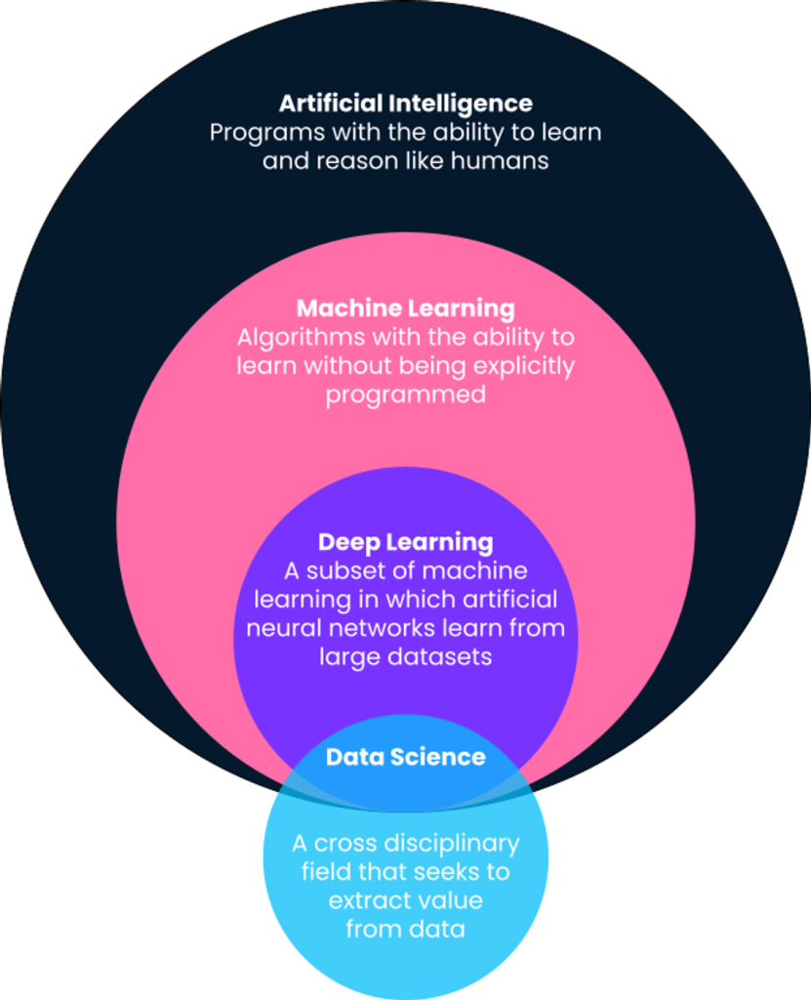

# Aula 4 - Conceitos Essenciais

**Objetivo:** apresentar uma definição sobre os conceitos de **Inteligência Artificial**, ***Machine Learning***,***Deep Learning*** e ***Data Science***.

## Inteligência Artificial

A **Inteligência Artificial (IA)** desenvolve **modelos de computação** com capacidade de absorver dados de maneira inteligente e **reproduzir** habilidades humanas e resolver casos complexos.

Exemplos de aplicação de **IA**:

- Reconhecimento de **linguagem** falada e escrita
- Aprendizagem a partir de **interação com o usuário**
- **Reconhecimento facial**
- **Identificação de padrões**
- Capacidade de **locomoção** automotiva
- Habilidade de **tomar decisões** conforme o contexto

## *Machine Learning*

***Machine Learning*** (Aprendizado de Máquina) é um **subconjunto** da **Inteligência Artificial**, que estuda a construção de algoritmos que podem **aprender** com os **dados**.

Arthur Samuel: "***Machine Learning*** é um campo de estudo que dá aos computadores a habilidade de aprender sem serem explicitamente programados."

***Machine Learning*** é composta de três abordagens:

- Aprendizado **Supervisionado**: classificação ou regressão
- Aprendizado **Não Supervisionado**: agrupamento de dados, *feature selection*, etc
- Aprendizado **Seni-Supervisionado** ou por **Reforço**

## *Deep Learning*

***Deep Learning*** é um **ramo** da ***Machine Learning*** que tem como objetivo modelar abstrações de alto nível de dados usando um grafo profundo com várias camadas de processamento, compostas de várias transformações lineares e não lineares.

A arquitetura é baseada em **Redes Neurais**, buscando imitar o cérebro humano.

Algumas técnicas de ***Deep Learning*** clássicas:

- *Artificial Neural Networks* (ANN)
- *Recurrent Neural Networks* (RNN)
- *Convolutional Neural Networks* (CNN)

## *Data Science*

***Data Science*** é uma ciência que abrange diversas disciplinas e um conjunto de técnicas para a **inferência** de dados e algoritmos para resolver problemas de negócio.

***Data Science*** faz uso do **método científico** e **algoritmos** para detectar padrões nos dados.

***Data Science*** faz uso de matemática, estatística, probabilidade, **inteligência artificial**, ***machine .learning***, ***deep learning***.

## Conclusão

A imagem a seguir apresenta um resumo do relacionamento entre os conceitos de **Inteligência Artificial (IA)**, ***Machine Learning***, ***Deep Learning*** e ***Data Science***.

